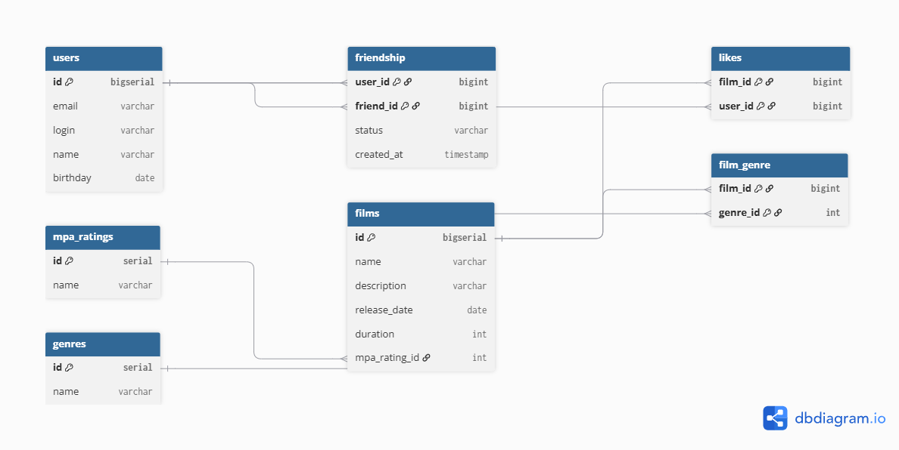

# Filmorate

Социальная сеть для киноманов: ставь оценки, добавляй друзей и следи за рейтингом фильмов.

## Схема базы данных



## Технологии

- Java 21
- Spring Boot 3
- Spring JDBC (JdbcTemplate)
- H2 Database
- Lombok
- Maven

## Функциональность

- Создание, обновление, удаление пользователей и фильмов
- Односторонняя дружба с подтверждением (статусы PENDING / CONFIRMED)
- Лайки фильмов
- Топ популярных фильмов по лайкам
- Общие друзья

## Примеры запросов


```sql
Получить все фильмы с жанрами и рейтингом
SELECT 
    f.*,
    m.name AS mpa_rating,
    STRING_AGG(g.name, ', ') AS genres
FROM films f
LEFT JOIN mpa m ON f.mpa_id = m.id
LEFT JOIN film_genre fg ON f.id = fg.film_id
LEFT JOIN genres g ON fg.genre_id = g.id
GROUP BY f.id, m.name;

Топ популярных фильмов по лайкам
SELECT
    f.id,
    f.name,
    COUNT(l.user_id) AS likes_count
FROM films f
LEFT JOIN likes l ON f.id = l.film_id
GROUP BY f.id
ORDER BY likes_count DESC
LIMIT 10;

Получить друзей пользователя (подтверждённых)
sql
SELECT u.*
FROM friends f
JOIN users u ON f.friend_id = u.id
WHERE f.user_id = 1 AND f.status = 'CONFIRMED';